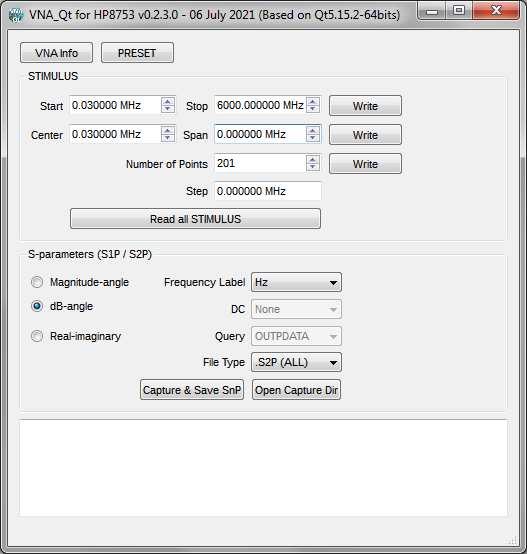

The vna_qt application allows
* To read/write all main VNA Stimulus
  * Frequency Start / Stop, Frequency Center / Span (compute the Frequency Step in MHz)
  * Number of Points
* To acquire Touchstone ".S1P and .S2P" files (called also Snp) from HP 8753 series vector network analyzers with a Keysight USB/GPIB interface

This application has been developed & tested only with "Keysight 82357B USB/GPIB Interface USB 2.0" on Windows computer (32bits or 64bits).

This application is based on Qt5 framework and shall build & work fine on GNU/Linux too (not tested since lot of time), any contribution/fix are welcome.

A big part of the code in that project is taken from John Miles, KE5FX mainly because VNA.EXE is not compatible with "Keysight 82357B USB/GPIB Interface USB 2.0"
* Code available on http://www.ke5fx.com/gpib/readme.htm (included in GPIB Toolkit)
* Main code used from John Miles are spline.cpp & sparams.cpp and lot of other parts are related to VNA.EXE source code.
* It support both 32bits and 64bits visa lib.

Pre-Requisites: 
* Software Qt Creator 4.x (to build the code)
  * For development I use Qt Creator which compile the code with Visual Studio 2019 Community with static build of Qt 5.x (to avoid any external dependencies)
    * To do a static build of Qt 5.15.2 (with Visual Studio 2019) see Build_Qt5_15_2_msvc2019_64bits.md
* Software: VISA Components
  * Path for VISA components after installation is available in vna_qt.pro
  * For the development/test I have used KeySight IOLibSuite_18_1_24130.exe
    * See https://www.keysight.com/en/pd-1985909/io-libraries-suite (it is freely available after free registration)
* Hardware: HP 8753 series vector network analyzers
  * This application has been tested only with HP 8753D VNA with firmware 06.14 with OPTS 002 006 010 (from 30kHz to 6GHz)
